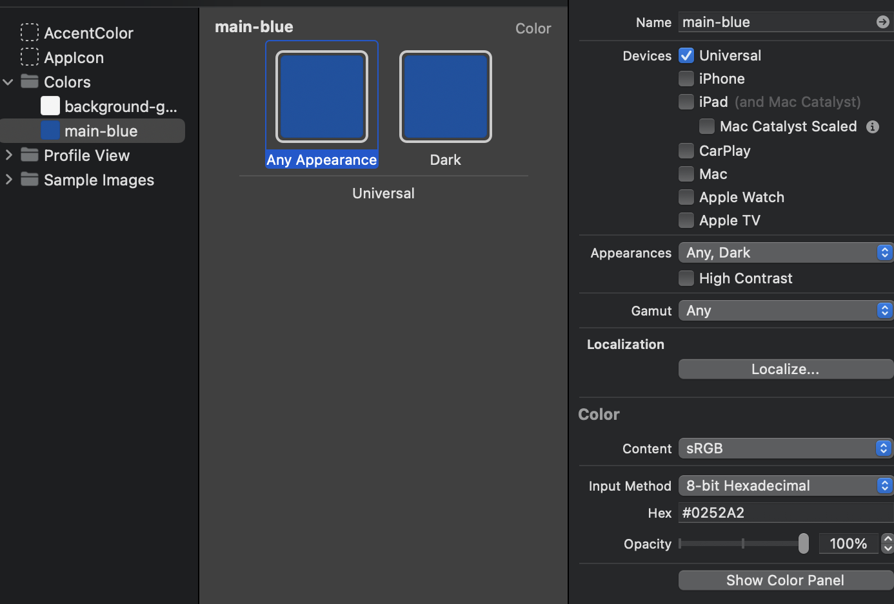

#  Design SwiftUI Figma Design to Demo Code
Based on the module six of the Code With Chris Design course:
 https://learn.codewithchris.com/courses/take/design/lessons/26502604-lesson-6-implementing-profile-screens-part-2 

# Custom Fonts
You can implement your own custom font, then use them throughout the project by superceding the standard fonts. 
If you use some of the same font names like title, header, etc. then you can change the font used for these in a
single place in your entire app. 

Note the Extension file that enables this `Utilities/Fonts.swift`:
```
/*
 Sets these as the default fonts
 SF Pro Display
 - SFProDisplay-Regular
 - SFProDisplay-Semibold
 - SFProDisplay-Bold
 SF Pro Text
 - SFProText-Regular
 */
extension Font {
    
    static var title = Font.custom("SFProDisplay-Bold", size: 28)
    
}
```

# Standard Colors
You can standardize colors throughout your app by using color sets, which custom define the names of 
colors. Once you define this color, you can reference it by name throughout the rest of the app. You create color sets within the 
`Assets.xcassets` folder. This way you only need to change the color in a single place instead of changing it throughout your entire
app. You can also standardize the colors, versus needing to always reference a different color.


Then you can call the color by name:
```
// Background color
Color("main-blue")
    .ignoresSafeArea()
```

